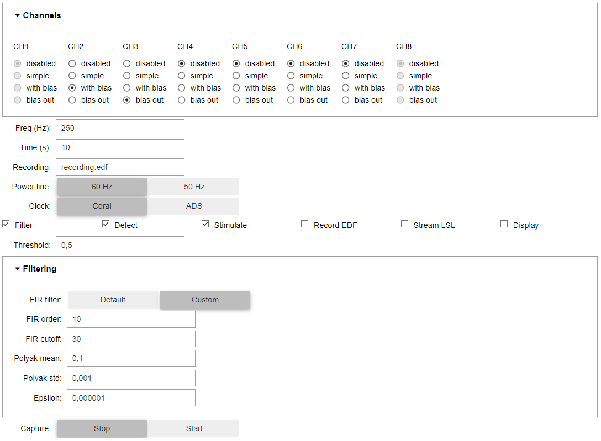

# Portiloop software

This software works with the [Coral implementation](https://github.com/Portiloop/portiloop-hardware) of the `Portiloop` EEG closed-loop stimulation device.

It enables controlling the `Portiloop` from a simple Graphical User Interface (GUI).

## Quick links
- [Installation on the Portiloop](#installation)
- [GUI usage](#usage)

## Usage:

The `Portiloop` GUI is a web-based interface running as a `jupyter` server.

- Connect to the `Portiloop` WiFi network.
- Open your favorite web browser
- Enter the following address: `192.168.0.1:9000`

You should now be connected to the `jupyter` server.

_If the jupyter notebook is not yet created:_
- Hit `New` and select `Python 3`.

This creates a `jupyter` notebook, in which you can simply paste and execute te following:

```python
from portiloop.capture import Capture

cap = Capture()
```

_When the jupyter notebook is created:_

You can open the notebook and simply execute the cell.

The GUI now looks like this:



### Channels:

The `Channels` pannel enables you to configure each electrode:
- `disabled`: the electrode is not used
- `simple`: the electrode is simply used to measure signal (not recommended)
- `with bias`: the electrode is used to measure signal and to compute a bias ("ground") signal
- `bias out`: the electrode is used to output the bias ("ground") signal

### General controls:

- `Freq` is the desired sampling rate
- `Time` is the maximum duration of the experiment (you can also stop the experiment manually)
- `Recording` is the name of the `.edf` output file if you wish to record the signal locally
- Tick `Filter` to enable the online filtering pipeline
- Tick `Detect` to enable the online detection pipeline
- Tick `Stimulate` to enable the online stimulation pipeline
- Tick `Record EDF` to record the signal in the file designated in `Recording`
- Tick `Stream LSL` to broadcast the signal on the local network via [LSL](https://labstreaminglayer.readthedocs.io/info/intro.html)
- Tick `Display` to display the signal in the GUI
- `Threshold` enables customizing the optional detection threshold from the GUI (e.g., for classifiers)
- The `Clock` widget lets you select the sampling method:
  - `Coral` sets the `ADS1299` sampling rate to twice your target sampling rate, and uses the Coral Real-Time clock to stick to your target sampling rate
  - `ADS` sets the `ADS1299` sampling rate to the closest compatible to your target sampling rate and uses the ADS interrupts

### Custom Filtering

The `Filtering` section lets you customize the filtering pipeline from the GUI.

- The `FIR filter` switch lets you select between the default low-pass FIR filter (used in the Portiloop [paper](https://arxiv.org/abs/2107.13473)), or customize this filter according to your needs (`FIR order` and `FIR cutoff`)
- `Polyak mean`, `Polyak std` and `Epsilon` let you customize the online standardization pipeline, which also acts as a high-pass filter

### Capture

The `Capture` switch lets you start and stop the experiment at any point in time

_Note: once the experiment is started, all widgets are deactivated until you stop the experiment._

## Installation (Portiloop V2):

You've just got your hands on the hardware for the Portiloop V2 (A Google Coral Mini and a PiEEG board). Here are the steps you need to follow to get started using the EEG capture, the Spindle detection software, and the TPU processing.

### Flashing the Google Coral
Find the instructions to update your Coral Dev Board Mini to the last OS version [here](https://coral.ai/docs/dev-board-mini/reflash/).

_(We recommend the force-fastboot method, as it works without `mdt`)_

### Accessing the Google Coral

These first steps will help you set up an SSH connection to the device.

- Power up the board through the USB power port.
- Connect another USB cable to the OTG-port on the board and to your _linux_ host machine. Follow the following steps to connect to the board through serial:
  - `ls /dev/ttyMC*`
  - `screen /dev/ttyACM0`
    If you see a message telling you that screen is busy, you can use `sudo lsof /dev/ttyMC0` and then retry the screen step.
  - Login to the board using default username and password: mendel
- Once you are logged in, you can now connect to you desired wifi network using nmtui.
- If you want to access the board through ssh (which is recommended for any sort of development):
  - On the serial console, open the `/etc/ssh/sshd_config` file.
  - Scroll down to the `PasswordAuthenticated` line and change the 'no' to a 'yes'.
- Reboot the device.
  Once all of that is done, you should be able to ssh into your device, using either the ip address or the hostname. If some issues arise, make sure you are connected to the same network.

### Installation

- Clone this repository in the home folder,
- `cd` into the cloned repository,
- Run `bash installation.sh` and follow the instructions,
- Shut the Portiloop down (`sudo shutdown now`, then unplug the battery),
- Plug the battery and turn the Portiloop on. After a minute, you should see the WiFi network appear on your computer. Connect to this network.

That's it! Your Jupyter server should now be up and running, listening on IP address 192.168.4.1 and port 8080, and automatically starting whenever the system boots up. You can now access it by typing 192.168.4.1:8080 in your browser. This should lead you to a login page where you'll be prompted for your password. If any issue arise, try with a different web browser.
